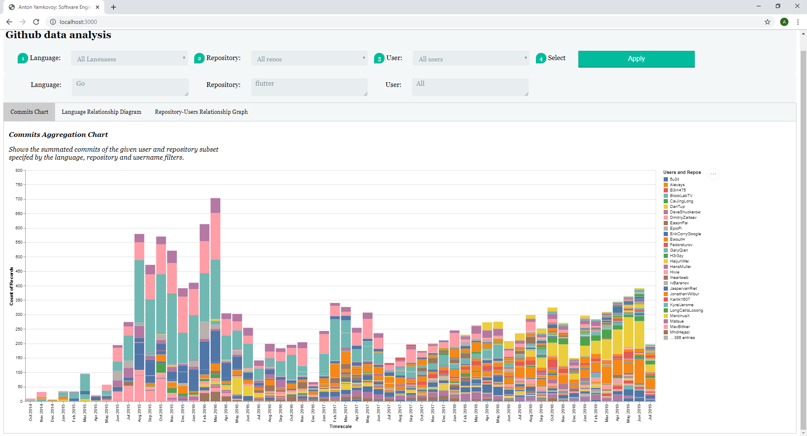
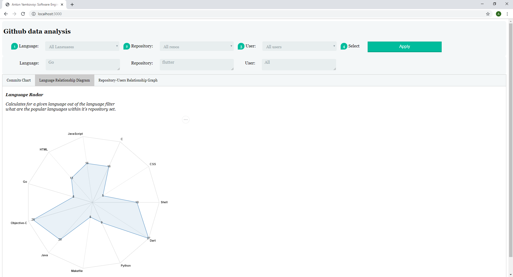
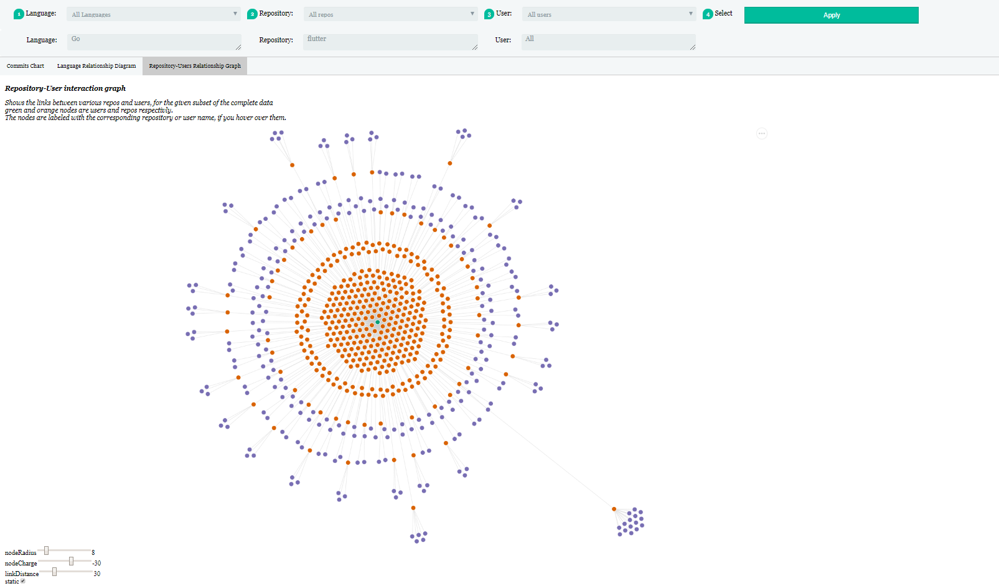
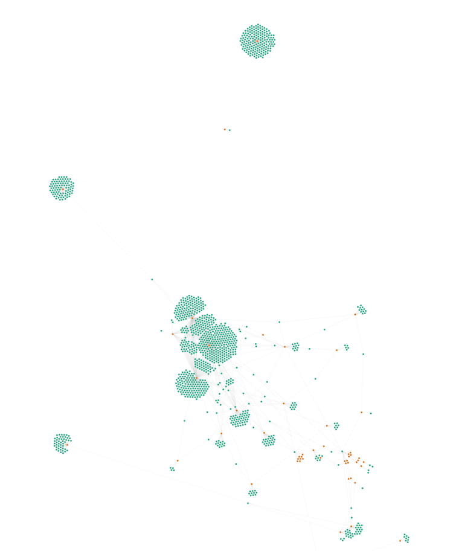
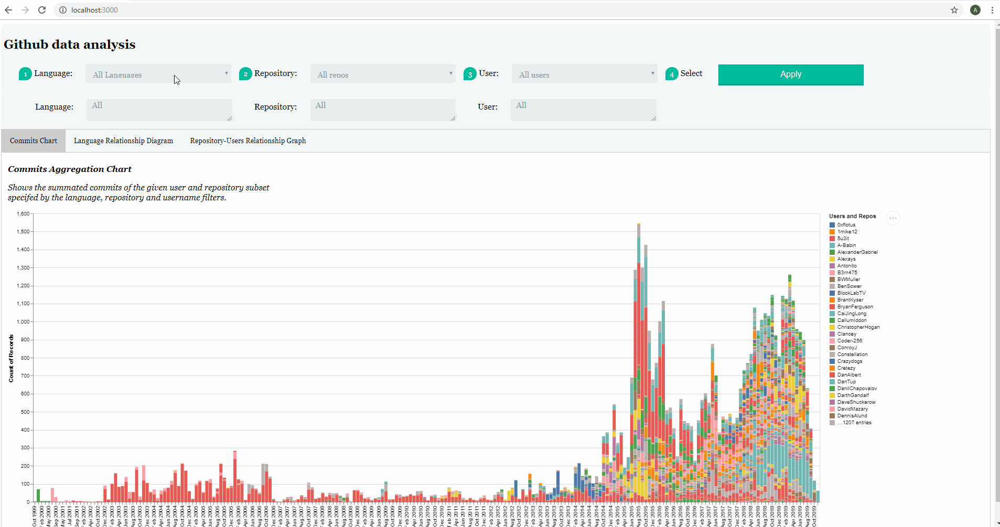

**Github Access Part 1:**

contained in the python test.py file
referencing commit  df920d7d0f1db0fc10770c804c8da404a8bf55b2
The script, prints out the selected data from a users profile, passed in as a list of usernames to the scraper.
and the data is logged into the database.

**Github visualisation part 2:**

 
 
The dataset used in this project was collected using the scraper in github-access part1, the data is around 50k commits from a set of users and repos, all related somewhere around flutter.

Consists of 3 tabs of visualisations:

1. Commits over time stacked per person, can be filtered by language, repository and user, with cases for all languages
   all repositories or both.
   
   
   
2. Radar graph showing the popular languages within a repository set, this can be filtered by the language dropdown.

   

3. Force directed layout graph, showing the connections between repos and users, can also be filtered using the three dropdowns, and has      settings for link length, node charge and node size, and a static boolean

  
   
   
**Gif Examples of site**

Animation of force directed layout:
     

Label interaction force directed layout:

 
 
All users, All repos graph
 
 
  
 
 **Gif Examples full run through**
 
 
 
 
  
  
   
 

